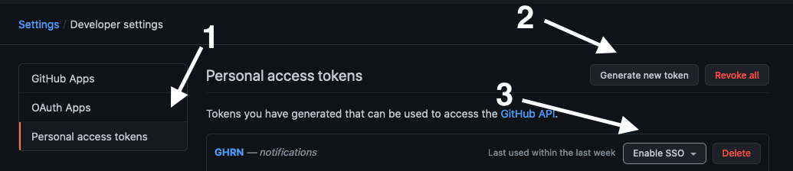

# ghrn

Get desktop notifications for Github pull request reviews.

[](https://oclif.io)
[](https://npmjs.org/package/ghrn)
[](https://github.com/Tutuchan/ghrn/blob/master/package.json)

- [Installation](#installation)
- [Setup](#setup)
- [Usage](#usage)

# Installation
<!-- installation -->
```bash
npm install -g ghrn
```

If using [asdf](https://asdf-vm.com/#/), you need to reshim `nodejs` to see the `ghrn` CLI.

```bash
asdf reshim nodejs
```

# Setup



## Prerequisites

1. Navigate to your Github settings,
2. Create a Github personal token with the `notifications` scope
3. Enable SSO if needed to access organizations' repos
4. Create a `GHRN_TOKEN` environment variable with the token created in step 2 as value

## Clear your notifications

:warning: **Navigate to your [notifications page](https://github.com/notifications?query=reason%3Areview-requested) and mark all current requests as read not to be spammed at the first execution** :warning: 

## For Mac users

1. The first time `ghrn` runs, you will be asked to allow Desktop notifications
2. Go to *System preferences > Notifications* and look for **terminal-notifier**
3. Choose the `Alerts` alert style, otherwise the notifications disappear after 5 seconds and they can't be clicked to reach the PR URL
<!-- installationstop -->
# Usage

```bash
$ ghrn --help
Get notified for review requests

USAGE
  $ ghrn

OPTIONS
  -f, --frequency=frequency  [default: 60] how often (in seconds) should notifications be checked
  -h, --help                 show CLI help
  -v, --version              show CLI version

```

Running `ghrn` without any parameters will poll Github every 60 seconds for review requests as long as it keeps running.
